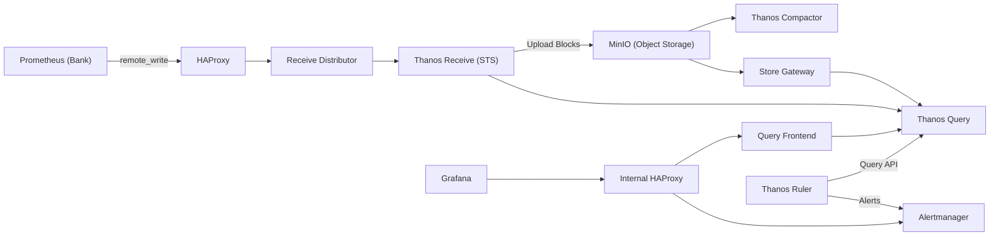

# Thanos Observability Architecture

```mermaid
flowchart LR

%% Bank Side
Prometheus["Prometheus (Bank)"]
HAProxyExt["HAProxy"]
Distributor["Receive Distributor"]
Receive["Thanos Receive (STS)"]
MinIO["MinIO (Object Storage)"]

Prometheus -->|remote_write| HAProxyExt
HAProxyExt --> Distributor
Distributor --> Receive
Receive -->|Upload Blocks| MinIO

%% Storage + Processing
Compactor["Thanos Compactor"]
MinIO --> Compactor

%% Query Plane
Store["Store Gateway"]
QueryFrontend["Query Frontend"]
Query["Thanos Query"]

MinIO --> Store
Store --> Query
Receive --> Query
QueryFrontend --> Query

%% Alerting
Ruler["Thanos Ruler"]
Alertmanager["Alertmanager"]

Ruler -->|Query API| Query
Ruler -->|Alerts| Alertmanager

%% User Layer
HAProxyInt["Internal HAProxy"]
Grafana["Grafana"]

Grafana --> HAProxyInt
HAProxyInt --> QueryFrontend
HAProxyInt --> Alertmanager
```
