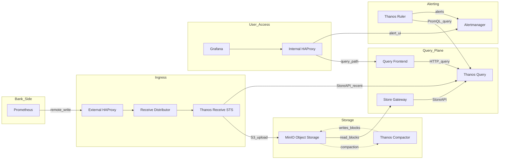

```mermaid
flowchart LR

%% =========================
%% BANK / INGESTION
%% =========================
subgraph Bank_Side
    Prom[Prometheus]
end

subgraph Ingress
    ExtProxy[External HAProxy]
    Distributor[Receive Distributor]
    Receive[Thanos Receive STS]
end

Prom -->|remote_write| ExtProxy
ExtProxy --> Distributor
Distributor --> Receive

%% =========================
%% STORAGE
%% =========================
subgraph Storage
    MinIO[MinIO Object Storage]
    Compactor[Thanos Compactor]
end

Receive -->|S3_upload| MinIO
MinIO -.->|compaction| Compactor
Compactor -.->|writes_blocks| MinIO

%% =========================
%% QUERY
%% =========================
subgraph Query_Plane
    Store[Store Gateway]
    QueryFrontend[Query Frontend]
    Query[Thanos Query]
end

MinIO -->|read_blocks| Store
Store -->|StoreAPI| Query
Receive -->|StoreAPI_recent| Query
QueryFrontend -->|HTTP_query| Query

%% =========================
%% ALERTING
%% =========================
subgraph Alerting
    Ruler[Thanos Ruler]
    Alertmanager[Alertmanager]
end

Ruler -->|PromQL_query| Query
Ruler -->|alerts| Alertmanager

%% =========================
%% USER ACCESS
%% =========================
subgraph User_Access
    Grafana[Grafana]
    IntProxy[Internal HAProxy]
end

Grafana --> IntProxy
IntProxy -->|query_path| QueryFrontend
IntProxy -->|alert_ui| Alertmanager
```
